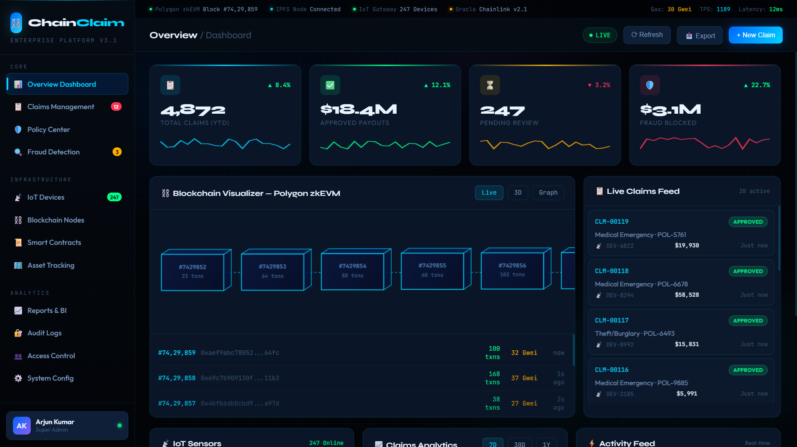

# ⛓️ ChainClaim — Enterprise Blockchain Insurance Platform

> Polygon zkEVM + Chainlink Oracle + IPFS + IoT Sensors

---

## 📸 Screenshots

## 📸 Screenshots

### Dashboard


### IoT Analytics


### New Claim

---

## 🏗️ Project Structure

```text
CHAINCLAIM/
├── backend/
│   ├── controllers/
│   │   └── claimController.js
│   ├── models/
│   │   ├── Claim.js
│   │   └── User.js
│   ├── routes/
│   │   └── claimRoutes.js
│   └── server.js
├── contracts/
│   └── ClaimProcessor.sol
├── scripts/
│   └── deploy.js
├── iot/
│   └── sensor_collector.py
├── deployments/
├── assets/
│   └── screenshots/
├── index.html
├── script.js
├── style.css
├── hardhat.config.js
├── .env.example
├── package.json
└── README.md
```

---

## 🚀 Setup & Run

### 1. Install Dependencies

```bash
npm install
```

### 2. Configure Environment Variables

```bash
cp .env.example .env
```

Update the `.env` file with your credentials and API keys.

### 3. Compile Smart Contracts

```bash
npm run compile
```

### 4. Deploy Contracts

```bash
npm run deploy:testnet
```

### 5. Start Backend Server

```bash
npm run dev
```

### 6. Start IoT Collector

```bash
npm run iot
```

---

## 🌐 Network Information

| Network | Chain ID | RPC Endpoint |
|----------|----------|-------------|
| Polygon zkEVM Testnet | 1442 | https://rpc.public.zkevm-test.net |
| Polygon zkEVM Mainnet | 1101 | https://zkevm-rpc.com |

---

## 📡 API Endpoints

| Method | Endpoint | Description |
|----------|----------|-------------|
| GET | `/api/claims` | Get all claims |
| POST | `/api/claims` | Create new claim |
| GET | `/api/claims/:id` | Get claim by ID |
| PUT | `/api/claims/:id` | Update claim |
| DELETE | `/api/claims/:id` | Delete claim |
| POST | `/api/auth/login` | User login |
| POST | `/api/auth/register` | User registration |

---

## 🔑 Environment Variables

```env
MONGO_URI=
JWT_SECRET=
PRIVATE_KEY=
POLYGON_ZKEVM_RPC=
POLYGONSCAN_API_KEY=
INFURA_IPFS_PROJECT_ID=
```

---

## ⚡ Tech Stack

- Blockchain: Polygon zkEVM
- Smart Contracts: Solidity + Hardhat
- Oracle: Chainlink
- Storage: IPFS
- Backend: Node.js + Express.js
- Database: MongoDB
- IoT Integration: Python
- Frontend: HTML, CSS, JavaScript, Web3.js

---

## 👨‍💻 Developer

**Kaveesh Dhiman**

- Ex-Intern @ National Informatics Centre (NIC), Government of India
- B.Tech CSE (IoT, Cyber Security & Blockchain)
- Dronacharya College of Engineering
- Email: kaveesh9876@gmail.com

---

## 📄 License

This project is developed for educational, research, and portfolio purposes.
